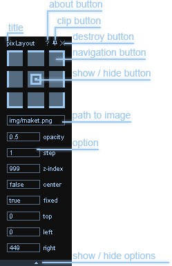

# pixLayout


**[pixLayout](http://pixlayout.polycreative.ru) - is a jQuery plugin for per-pixel layout**

**[DEMO](http://pixlayout.polycreative.ru/test.html)**

While websites layouting an exact resemblance with model is required. Sometimes this is required by customer, sometimes by superior, and sometimes you want strictly fit the design, but moreover, sometimes per-pixel equivalence is a necessary thing. pixLayout was created to facilitate maximally the work of the pixel layout designer and measuring distances and margins. pixLayout is a picture-layer, which can be managed by the panel at the top right corner of the document window, hotkeys, or just by moving it with the mouse. At any time, the panel can be hidden or completely liquidate the whole html and css of the plugin. For dynamic layout adjusting is very convenient to use the Developer Tools in Chrome or FireBug in Firefox.

### Pixlayout advantages over other similar plug-ins and add-ons:
1. **Not only works in one browser.** As pixLayout is a javascript-code it’s enough to include it to head and it will work in all supported browsers. After the end of layout you can merely disconnect the plugin.
2. **Functionality.** Plugin provides all necessary functions and settings for convenient picture-layer control.
3. **Crossbrowsering and crossversioning.** pixLayout works in browsers chrome5+, opera 11+, firefox 3,6+, IE 7+, as well as on all versions of jQuery beginning from the 1.3.2.
4. **All in one file.** In contrast to many plugins, which include besides js-code, and even style files, and frequently  pictures, pixLayout consists of a single file in which all the components are already embedded.
5. **Free of charge and permanent project development.** Plugin is spreaded absolutely free under license GPL 2 and constantly evolves.

### Bower
```
# registered package
$ bower install --save pixlayout
# GitHub shorthand
$ bower install --save kudinovfedor/pixlayout
# Git endpoint
$ bower install --save git://github.com/kudinovfedor/pixlayout.git
```

### How to start?
```
<script type="text/javascript" src="//code.jquery.com/jquery-1.11.3.min.js"></script>
<script type="text/javascript" src="js/jquery.pixlayout.0.9.7.js"></script>;
<script type="text/javascript">;
  $(function(){
    $.pixlayout("/path_to_picture/picture.ext");
  });
</script>;
```

### Some parameters transmission and context example:
```
$(function(){
  $.pixlayout({
    src: "/img/layout.jpg",
    opacity: 0.8,
    top: 50,
    center: true,
    clip: true,
    show: true
  }, ".wrapper");
});
```
Parameter | Type | Possible values | Description
--------- | ---- | --------------- | -----------
src | string | way to the picture-layer | way to the picture-layer |
opacity |	float |	0.0 - 1.0 | opacity
step |	integer |	from 1 to infinity |	step moving image in pixels
top, left, right |	integer |	from 1 to infinity |	indention in pixels
zindex |	integer |	from 1 to infinity |	picture-layer location on the axis z
clip | boolean |	true or false |	panel fixed or not
center | boolean |	true or false |	picture in the center or not
fixed |	boolean |	true or false |	picture position is fixed or not
show | boolean |	true or false |	show the picture when loading or not

### Context:
You can specify any element on the page as the context and the picture-layer will add to the end of this element. By default, such an element is body. Context is specified as the second parameter.<br/>
**Example:**
```
$.pixlayout("img/picture.png", "div.wrapper");
```

### Displacement:
1. buttons:'left', 'right', 'down'
2. buttons:w,a,s,d, when the picture is visible
2. navigation buttons

### Operations:
1. Destroy (remove all html and css code pixLayout from the page) – the 'x' in the upper right corner.
2. Secure the panel – the icon in the upper right corner of the panel
3. Quick reference: the question mark in the upper right corner of the panel
4. To roll up settings – arrow 'up' downwards of the panel
5. Show/hide the picture – the center button of the navigation bar or shift+e
